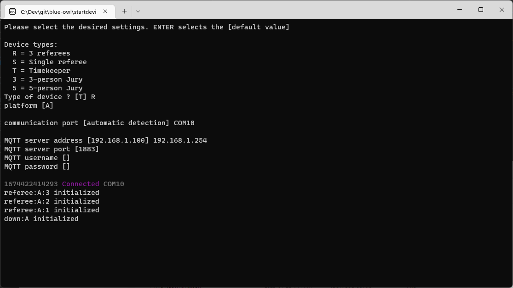

# Installing and Running on Windows

## Initial Install

This step is needed only once per laptop that will have a device attached to it.  

- From the [Releases](https://github.com/owlcms/blue-owl/releases) directory, locate the `startdevice.exe` program and download it to each laptop that will have a device connected to it.  Move the file to the Desktop, for convenience.

## Starting the Devices

At the start of the competition setup, start the owlcms server and get its address:  

- owlcms opens a window when it starts. Note the address it is advertising.  If you see something like `http://192.168.0.100:8080` then what you need to write down is the numerical part `192.168.0.100` 
- Also note the platform name (or names) being used.

Then for each device you want to plug in

1. Plug in your device to a USB port.
2. Double-click on the `startdevice.exe` program and provide the requested information.
   - Normally, the communication port will be discovered automatically. If not see below.
   - When asked for the MQTT server address, type the address you noted in step 1.

You should see something similar to the following.  If you get an error message, see the next section.

## Troubleshooting

### Communication Port Not Detected

The software attempts to detect to which communication port the device is attached.  If it can't find it automatically, then you have to provide it. 

1. open a command-line window: left-click *once* on the Windows logo ⊞ and type `cmd`
2. Type the `mode` command.  This will list the communications ports on your laptop. Look for the ports starting with "COM".  You will likely have only one or two.  Try each.

### Device or Firmware Error

This indicates that the device is not correctly configured or has not finished initializing.  Disconnect the device and connect it again.  Leave it time to boot (about 15 seconds).  Then run the program again.

#### ECONNREFUSED

This happens when the device-hosting laptop is actively denied access to the MQTT server.  There are two causes:

- owlcms is not running at the address you indicated, and so there is no MQTT server to connect to.
- If owlcms is running, then the likely cause is that port 1883 is blocked by a firewall on the owlcms laptop.  The quickest way to work around this issue is by disabling the firewall. See [this link](https://www.alphr.com/turn-off-windows-firewall/) for instructions.  Once the rush is over you can configure the owlcms laptop more cleanly to open ports 8080 an 1883. See [this tutorial](https://www.howtogeek.com/394735/how-do-i-open-a-port-on-windows-firewall/) on opening ports.

### MQTT Server Offline

The likely cause is that you mistyped the MQTT server address.  The address you typed cannot be reached. There is typically a 30 second timeout before the server is deemed to be unreachable.

### Wrong Username or password

On owlcms, it is possible to configure a username and password.  Use the menu to go to the `Preparation` section, and open the `Language and Settings` page.  From there, the `Connexion` section contains the parameters.

## Advanced Scenarios

### More than one device on the same laptop

If you need more than one device, you can start the program several times.  You can use the `mode` command after adding each device to know what device is on what port.

### Cloud Usage

- If you are running a cloud competition, then the MQTT server is not provided by owlcms.  You need to use an external broker that both owlcms and the device-hosting laptops will use.  Refer to the MQTT instructions for owlcms.

