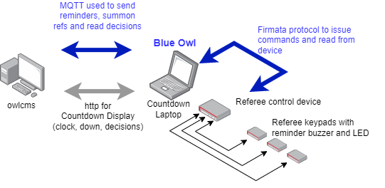
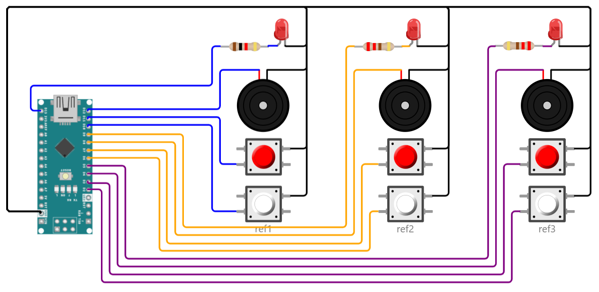

# Blue Owl

Blue Owl provides Technical Official device integration for [OWLCMS](https://owlcms.github.io/owlcms4/). The [Johnny-Five](http://johnny-five.io/) software is used to control the devices' microprocessors using the [Firmata](https://github.com/firmata/protocol) protocol.

### About this Fork

- This fork does not replace the upstream directory by Scott González.  The files in `src/scripts` are meant to be identical to the official upstream version.
- This fork adds a `build-it-yourself` directory that contains
  - Diagrams for building your own devices.  The diagrams have a different pin layout than the official ones which have been designed with for printed circuit boards.
  - Definitions of the build-it-yourself devices that are usable by Blue Owl.  These are identical to the ones in the official directory, except that the pin locations are changed to match the build-it-yourself diagrams.
  - Definitions of the build-it-yourself devices and instructions for running them on the [wokwi.com](https://wokwi.com) simulator.  You can actually connect the simulated devices to owlcms, click on the virtual buttons, see the virtual LEDs and hear the virtual beeps.

## Features

- No coding whatsoever required to is build the devices.  Standard Firmata firmware is loaded on the devices, once.
- Schematics and configurations are provided for building the physical devices yourself.
- A pre-packaged Blue Owl software kit is provided to connect with owlcms.

## Overview

The following diagram illustrates the concept. We use the Refereeing devices as an example, but the same applies to the Jury and Timekeeper devices.

- The Referee Control Box contains a tiny Arduino Nano microprocessor that is pre-loaded with the Firmata software.  It gets its power and instructions from the Countdown athlete-facing laptop.  Each referee keypad contain two buttons, a buzzer, and a LED.

  

- Blue Owl acts as a relay between owlcms and the Arduino.
  - The control box reads the buttons pressed by referees when they enter decisions.  it notifies Blue Owl using the Firmata protocol.  Blue Owl relays the events to owlcms using [MQTT messages](https://owlcms.github.io/owlcms4/#/MQTTMessages).
  - Blue Owl reads MQTT commands from owlcms and sends Firmata instructions to the referee control box. The control box can then activate the LEDs or buzzers on the referee devices.
  
- If owlcms is modified, the only thing that needs to change is the Blue Owl software on the laptop.
  - There are different launchers for each device that call the appropriate definition script for the device.
  - The jury Blue Owl would run on the jury laptop, the referee Blue Owl would run on the countdown laptop, and the timekeeper Blue Owl would run either on the announcer or timekeeper laptop.

## Running Blue Owl

Scripts to start the build-it-yourself devices are found in the `windows` and `bash` (for macOS and Linux).  These scripts are included in the blue-owl packages found in the Releases.  Instructions for installation are found in [Installing](INSTALLING.md)

## Supported Devices

### Referees

Referee control boxes may be used in compliance with the IWF Referee Light System as documented in TCRR 3.3.6. The referee control boxes support:

* White and red buttons for "Good lift" and "No lift".
* White and red LEDs to confirm decision entry.
* LED, buzzer, and vibration to signal when a decision is required.
* LED, buzzer, and vibration to signal when summoned to the jury table.

#### Single Referee Mode

For competitions run with only one referee, a script configures all three referees to the same buttons. So the same decision is sent unanimously 3 times. 

### Timekeeper

The timekeeper control box may be used to fully control the timing clock as documented in TCRR 7.10. The timekeeper control box supports:

* Starting the clock.
* Stopping the clock.
* Resetting the clock to one minute.
* Resetting the clock to two minutes.

### Jury

The jury control panel and jury control units may be used to fulfill all jury member requirements as documented in TCRR 3.3.6.11, TCRR 3.3.6.12, and TCRR 7.5. The jury control panel supports:

* Displaying referee decisions in real-time.
* Displaying jury member decisions.
* Summoning a referee.
* Summoning the technical controller.
* Stopping the competition for deliberation.
* Stopping the competition for a technical break.
* Resuming the competition.

## API

Blue Owl is programmed in JavaScript using the Johnny-Five implementation of Firmata.  The full specification of the devices is documented in the [API](API.md) document.

Blue Owl talks to owlcms using MQTT messages.  The full list of messages supported by owlcms is documented: [MQTT messages](https://owlcms.github.io/owlcms4/#/MQTTMessages).

## Installation

An MQTT server must be visible to both owlcms and Blue Owl.  Typically the MQTT server is installed on the same computer as owlcms.  See [Installing](Installing.md) for details

## About the name

Should you wonder,  OWL stands for is Olympic Weightlifting. Blue is the color of the official's suits, and the name is a salute to their keen eyes.

## License

Copyright Scott González. Released under the terms of the ISC license.

Buid-it-yourself files and layouts are Copyright Jean-François Lamy, Released under the terms of the ISC license.
