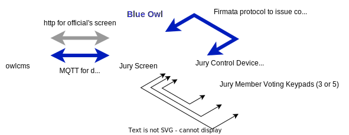

# Blue Owl

Blue Owl provides Technical Official device integration for [OWLCMS](https://owlcms.github.io/owlcms4/). The [Johnny-Five](http://johnny-five.io/) software is used to control the devices' microprocessor using the [Firmata](https://github.com/firmata/protocol) protocol.

> This fork focuses on providing a way to simulate the devices on the wokwi.com simulator.  The official software is in the `src/scripts` and is untouched relative to that in the upstream directory by Scott González.

## Overview

The following diagram illustrates the concept. We use the Jury device as an example, but the same applies to the Referee and Timekeeper devices.

- The Jury control box contains a small Arduino microprocessor that is pre-loaded with the Firmata software.
- Blue Owl acts as relay relay between owlcms and the Arduino. 
  - The USB connection between the computer is used for power and for exchanging information.
  - Blue Owl reads Firmata information sent by the Jury box and sends it to owlcms. For example, the decisions by each jury member, or the president entering that the previous lift is overturned.
  - Blue Owl reads commands from owlcms and sends Firmata instructions to the jury control devices. For example, resetting the various LEDs on the Jury box.
- If owlcms is modified, the only thing that needs to change is the Blue-Owl software on the laptop.
  - There are modules in Blue-Owl for each type of device
- Blue Owl is extremely configurable.  The files in the `scripts` directory contain the layout for fully compliant commercial devices built with printed circuit boards.  The `wokwi` directory contains fully compliant layouts that are suitable for "build-it yourself". You can also use these files to run a simulated Arduino on the [wokwi.com](https://wokwi.com) simulator, and even connect the simulation to a running owlcms.

## Supported Devices

### Referees

Referee control boxes may be used in compliance with the IWF Referee Light System as documented in TCRR 3.3.6. The referee control boxes support:

* White and red buttons for "Good lift" and "No lift".
* White and red LEDs to confirm decision entry.
* LED, buzzer, and vibration to signal when a decision is required.
* LED, buzzer, and vibration to signal when summoned to the jury table.

#### Single Referee Mode

For competitions run with only one referee, simply configure all three referees with the same buttons. This will cause the single referee control box to send a decision for all three referees.

### Timekeeper

The timekeeper control box may be used to fully control the timing clock as documented in TCRR 7.10. The timekeeper control box supports:

* Starting the clock.
* Stopping the clock.
* Resetting the clock to one minute.
* Resetting the clock to two minutes.

### Jury

The jury control panel and jury control units may be used to fulfill all jury member requirements as documented in TCRR 3.3.6.11, TCRR 3.3.6.12, and TCRR 7.5. The jury control panel supports:

* Displaying referee decisions in real-time.
* Displaying jury member decisions.
* Summoning a referee.
* Summoning the technical controller.
* Stopping the competition for deliberation.
* Stopping the competition for a technical break.
* Resuming the competition.

## API

Blue Owl is programmed in JavaScript using the Johnny-Five implementation of Firmata.  The full specification of the devices is documented in the [API](API.md) document.

## About the name

Should you wonder,  OWL is Olympic Weightlifting, Blue is the color of the official's suits, and the name is a salute to their keen eyes.

## License

Copyright Scott González. Released under the terms of the ISC license.

Wokwi files and layouts are Copyright Jean-François Lamy, Released under the terms of the ISC license.
